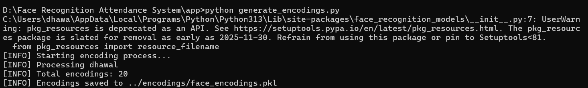
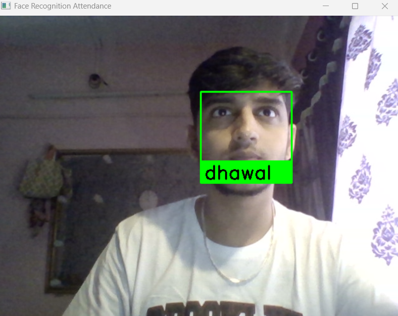
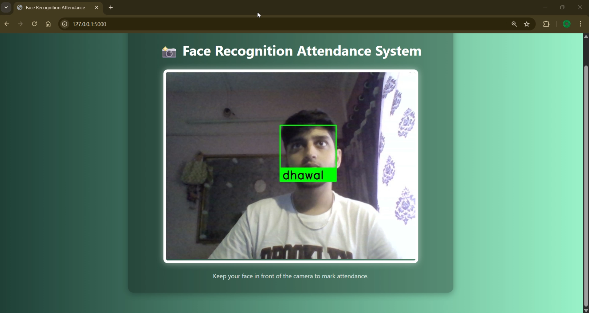

# 📷 Face Recognition Attendance System

An automated real-time attendance system using face recognition, implemented in two versions:

- 🖥️ **Backend (CLI)** — Command-line version using OpenCV and Python
- 🌐 **Web (Flask)** — Browser-based version with a styled Flask interface

> This project marks attendance automatically by detecting faces through webcam or any connected camera (including IP/phone camera).

---

## 📁 Project Structure

```

face-recognition-attendance-system/
├── backend/    # Command-line interface version
├── web/        # Flask-based web interface

````

---

## 🚀 Versions

### 🖥️ `backend/` – Python CLI App

- Uses OpenCV + face_recognition
- Logs attendance to `.csv` and `.xlsx`
- Simple and terminal-driven

#### 🔧 How to Run

```bash
cd backend/app
python register_faces.py         # Capture face images
python generate_encodings.py     # Generate encodings
python recognize_faces.py        # Start recognition
````

#### 📸 Sample Output



📹 `backend/recording.mp4`

---

### 🌐 `web/` – Flask Web App

* Live webcam feed in browser
* Responsive modern UI
* Marks attendance directly from browser

#### 🔧 How to Run

```bash
cd web
pip install -r requirements.txt
python app.py
```

Visit `http://127.0.0.1:5000` in your browser.

#### 🌟 Preview


📹 `web/web-recording.mp4`

---

## 🧠 Tech Stack

* Python
* OpenCV
* face\_recognition
* Flask
* OpenPyXL (for Excel logging)
* HTML + CSS (for web version)

---

## 📦 Features

✅ Real-time face recognition
✅ Logs to `.csv` and `.xlsx`
✅ Auto-skips duplicates
✅ Works with webcam or IP camera
✅ Web version with beautiful UI

---

## ✍️ Author

**Dhawal Sarode**
B.Tech CSE, Amity University (2021–2025)
📫 [dhawalsarode.ai@gmail.com](mailto:dhawalsarode7@gmail.com)
🔗 [LinkedIn](https://linkedin.com/in/dhawal-sarode)

---

## 📌 Acknowledgements

* Based on concepts from [@ageitgey](https://github.com/ageitgey)'s `face_recognition`
* UI styling inspired by modern Flask dashboards
* Course reference: *Face Recognition with Python – Udemy*

```

---

## ✅ What To Do Now

1. Create this file in:
```

D:\Face Recognition Attendance System\README.md

````

2. Then run:
```bash
git add README.md
git commit -m "Added root-level README.md for both backend and web"
git push
````


